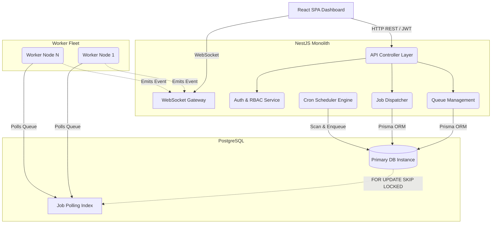
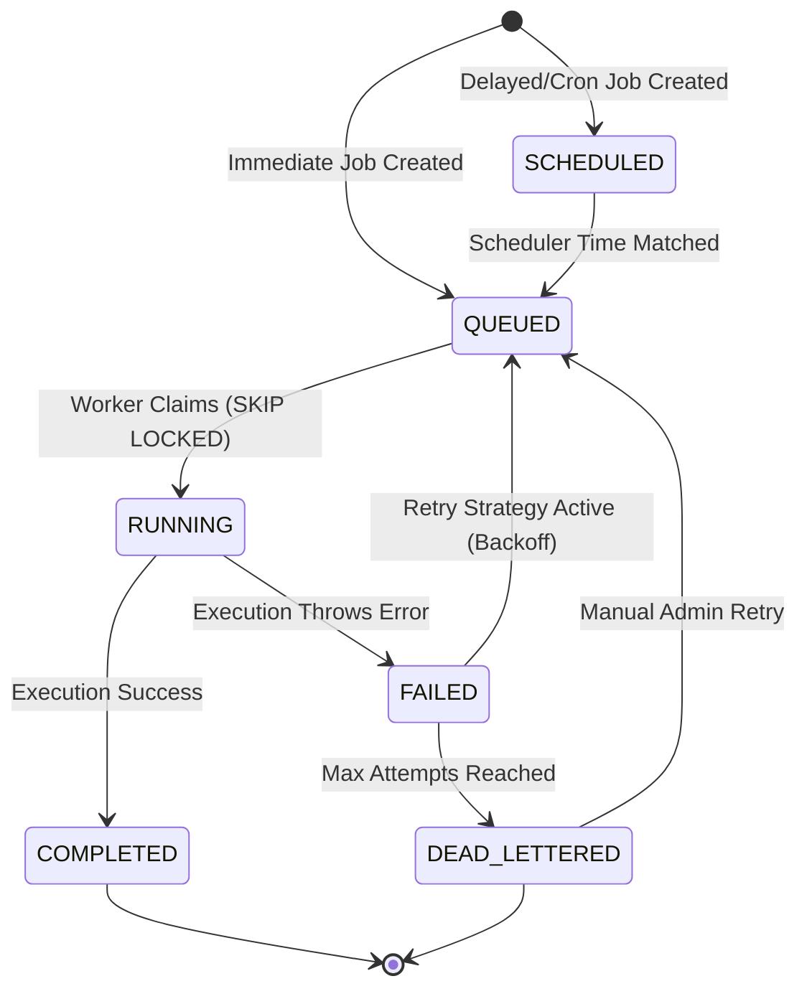
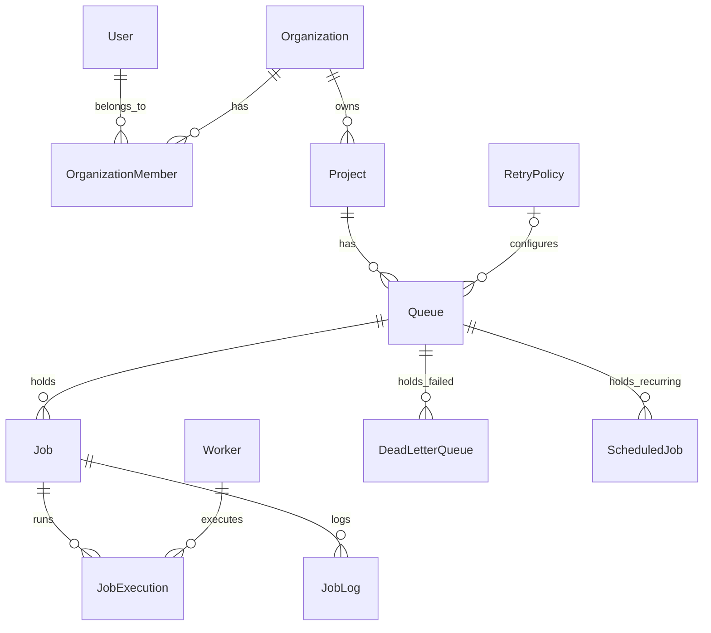
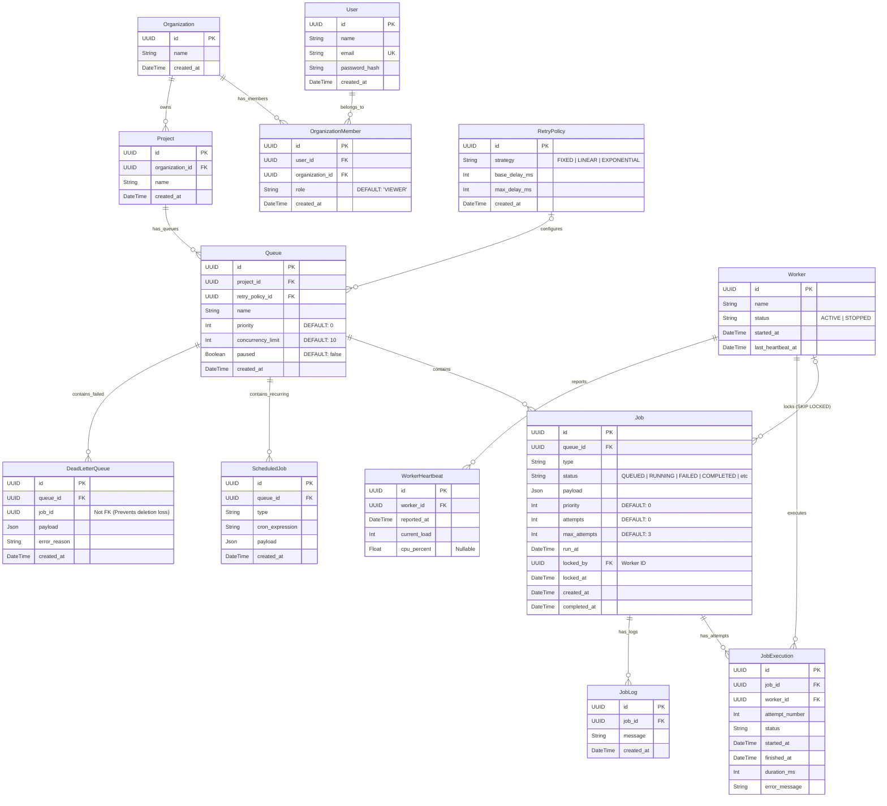

# Documentation & Technical Design Report

**Author:** RA2311026010509-Sanagala Gagan
**Repository:** https://github.com/Gagan8340/Distributed-Job-Scheduler

---

# Distributed Job Scheduler 


A highly reliable, horizontally scalable, and atomic distributed job scheduling platform. Designed as a production-grade backend system with a real-time glassmorphism React dashboard.

This system guarantees **exactly-once execution semantics** across multiple distributed workers using raw SQL transaction locking (`FOR UPDATE SKIP LOCKED`).

---

##  Core Features

*   **Atomic Concurrency:** Workers claim jobs atomically. No race conditions, no deadlocks, and no duplicate executions—even if 100 workers poll simultaneously.
*   **Event-Driven Execution:** Workers utilize PostgreSQL `LISTEN/NOTIFY` pub/sub to instantly wake up when new jobs arrive, eliminating wasteful CPU polling loops.
*   **Robust Job Lifecycle:** Supports jobs transitioning smoothly through: `Queued` → `Scheduled` → `Claimed` → `Running` → `Completed` / `Failed`.
*   **Retry & Dead Letter Queue (DLQ):** Dynamic retry policies (Fixed Delay, Linear Backoff, Exponential Backoff) with permanent failures routed to a DLQ for auditing.
*   **Workflow Dependencies (DAGs):** Jobs can depend on parent jobs, remaining in a `BLOCKED` state until their prerequisites complete successfully.
*   **Real-Time Control Plane:** A React SPA connected via WebSockets (`socket.io`) that provides live updates on queue depth, worker heartbeats, and job logs.
*   **Multi-Tenant Architecture:** Full RBAC and JWT Authentication. Jobs belong to Queues, Queues belong to Projects, and Projects belong to Organizations.

---

## Backend Engineering & Database Design

The system relies on PostgreSQL as its unified datastore and locking engine. By using `SKIP LOCKED`, we bypass the need for an external Redis queue, reducing infrastructure complexity while maintaining strict ACID guarantees.

For deep dives into the architecture, ER diagrams, and design trade-offs, please read the documentation in the `/docs` directory:
*   [Architecture Overview](docs/architecture.md)
*   [Database Design & ER Diagram](docs/database-design.md)
*   [Concurrency & Design Decisions](docs/design-decisions.md)

---

##  Getting Started

### Prerequisites
*   **Node.js** (v18+)
*   **Docker** (for running the PostgreSQL instance)

### 1. Database Setup
Start the PostgreSQL database via Docker Compose:
```bash
docker-compose up -d
```
*(Runs on `localhost:5432` | user: `postgres` | password: `password`)*

### 2. Backend Setup
The backend is a modular NestJS monolith.
```bash
cd backend
npm install

# Push the schema to the database and generate Prisma client
npx prisma db push
npx prisma generate

# Start the REST API and background Worker processes
npm run start:dev
```
*The API will be available at `http://localhost:3000`.*

### 3. Frontend & UX Dashboard Setup
The frontend is a Vite + React SPA.
```bash
cd frontend
npm install

# Start the development server
npm run dev
```
*The Dashboard will be available at `http://localhost:5173`.*

---

## Testing

The backend includes an automated test suite verifying the core worker logic (atomic claims, transaction rollbacks, graceful shutdown).
```bash
cd backend
npm run test
```

---

## API Design

The REST API is highly structured and protected by JWT authentication and rate limiting (`@nestjs/throttler`).

**Authentication**
*   `POST /auth/register` - Create a new user account
*   `POST /auth/login` - Authenticate and retrieve JWT
*   `GET /auth/me` - Get current user profile

**Queues & Jobs**
*   `GET /queues` - List all queues for a project
*   `POST /queues` - Create a new queue
*   `POST /queues/:id/pause` - Pause job processing for a queue
*   `POST /queues/:id/resume` - Resume job processing
*   `POST /jobs` - Dispatch a single job
*   `POST /jobs/batch` - Dispatch multiple jobs in a single transaction
*   `POST /jobs/:id/retry` - Manually requeue a dead-lettered job

**Workers**
*   `GET /workers` - List all active worker nodes and their last heartbeats


---

# System Architecture

## 1. High-Level System Architecture

The system is designed as a modular, monolithic repository utilizing NestJS for the backend, React for the control plane, and PostgreSQL as the unified datastore and locking engine. The architecture ensures high throughput, strict referential integrity, and horizontal scalability of worker nodes.



## 2. Job Lifecycle State Machine

To guarantee exactly-once claiming and safe retry semantics, jobs transition through a strict state machine validated at the database level.



## 3. Core Component Breakdown

### API Server (Controllers)
Exposes the RESTful endpoints. It is protected globally by `@nestjs/throttler` (Rate Limiting) and uses Passport-JWT alongside a custom `RolesGuard` for Role-Based Access Control (RBAC). It ensures that HTTP traffic is physically separated from worker execution loops to prevent event-loop blocking.

### Worker Engine (`WorkerService`)
The beating heart of the scheduler. It runs an asynchronous `setInterval` loop that executes raw SQL:
`SELECT id FROM "Job" WHERE status = 'QUEUED' AND run_at <= NOW() ORDER BY priority DESC LIMIT $1 FOR UPDATE SKIP LOCKED`
This query safely claims jobs without deadlocking concurrent workers. The worker updates the `JobExecution` table with start times, executes the payload (which must be designed idempotently), and records the final result (success/fail) to the `JobLog` table.

### Scheduler Engine (`SchedulerService`)
Handles recurring Cron jobs and delayed jobs. It utilizes `cron-parser` to continuously evaluate the `ScheduledJob` table, dynamically injecting new job records into the main `Job` table when the cron interval triggers.

### WebSocket Gateway (`EventsGateway`)
Forwards real-time execution events (e.g., job completions, job failures, worker heartbeats) back to the React Dashboard. This allows the UI to stay perfectly synchronized with the database state without expensive HTTP polling.

## 4. Scaling Characteristics
While the current MVP operates on a single PostgreSQL instance (which can easily handle thousands of jobs per second with the optimized `@@index([queue_id, status, run_at, priority])`), the architecture is entirely stateless at the application layer. You can instantly spin up 100 `WorkerService` instances across a Kubernetes cluster, and they will safely share the queue load due to the atomic `SKIP LOCKED` database design.


---

# Database Design

## Entity-Relationship Schema
The relational schema is highly normalized and designed for high throughput, utilizing PostgreSQL as the underlying engine. The database models the following core entities: `Users`, `Organizations`, `Projects`, `Queues`, `Jobs`, `JobExecutions`, `RetryPolicies`, `Workers`, `JobLogs`, `ScheduledJobs`, and `DeadLetterQueues`.



## Schema Explanations & Considerations

### Primary Keys & Foreign Keys
- **Primary Keys**: Every table utilizes a `UUID` as its primary key. UUIDs are generated at the application layer or database layer using `uuid_generate_v4()`. UUIDs are preferred over auto-incrementing integers to prevent ID-guessing (enumeration attacks), ease data migration, and allow disconnected clients to generate IDs before insertion.
- **Foreign Keys**: Explicit foreign keys enforce referential integrity across the hierarchy (e.g., `Job.queue_id` references `Queue.id`). 

### Cascading Behavior
- **ON DELETE CASCADE**: Hard links in the hierarchy utilize cascading deletes. For example, deleting a `Project` will automatically delete all associated `Queues`, which cascades down to `Jobs`, `JobExecutions`, and `JobLogs`. This prevents orphaned records and maintains strict database hygiene without requiring multi-step application-level deletion logic.

### Normalization
The database is strictly normalized (3NF) to reduce data anomalies and keep high-throughput tables lean:
- **Separation of Execution State**: The `Job` table only stores the *current* state and payload of a job. The history of attempts is normalized into the `JobExecution` table. This keeps the `Job` row size extremely small, which is critical because it is the most heavily polled and updated table in the system.
- **Separation of Logs**: Detailed textual logs are split into the `JobLog` table. Storing heavy text strings directly on the `Job` or `JobExecution` tables would cause PostgreSQL page bloat, significantly slowing down the worker polling queries.

### 5. Worker & WorkerHeartbeat
**Purpose**: Registers active worker nodes and tracks their continuous health and load capacity.

- **`Worker`**: Contains the `status` (`ACTIVE`, `STOPPED`) and a rapidly updated `last_heartbeat_at` field. Updating this field in-place provides extremely fast crash-detection for the cluster manager.
- **`WorkerHeartbeat`**: An append-only historical log satisfying strict auditing and analytics requirements. It records the worker's `current_load` (active jobs being processed) and `cpu_percent` at a given `reported_at` timestamp.

*Note: The hybrid approach (in-place `last_heartbeat_at` on Worker + append-only `WorkerHeartbeat` records) ensures we meet auditing requirements while avoiding slow analytical queries on the hot path.* 

### Indexes & Performance Considerations
Efficient indexing is the most critical component of a polling-based job scheduler. 
- **The Polling Query Index**: The worker continuously executes: 
  ```sql
  SELECT id FROM "Job" WHERE status = 'QUEUED' AND run_at <= NOW() ORDER BY priority DESC
  ```
  To make this `O(log N)` instead of a full table scan, a composite index is applied to the `Job` table:
  `@@index([queue_id, status, run_at, priority])`
  This exact covering index allows the PostgreSQL query planner to immediately identify candidate jobs without scanning non-relevant or locked rows.
- **Foreign Key Indexes**: All foreign keys (e.g., `queue_id` on `Job`, `job_id` on `JobExecution`) are indexed to ensure that cascading deletes and `JOIN` operations (like fetching a job with its executions) are nearly instantaneous.
- **SKIP LOCKED**: Performance is further guaranteed by utilizing PostgreSQL's `FOR UPDATE SKIP LOCKED`. When multiple concurrent workers hit the `Job` table index, they automatically bypass rows currently locked by other transactions, completely eliminating row-level lock contention and deadlocks.


---

# Entity-Relationship (ER) Diagram

This document contains the strict Entity-Relationship model mapping precisely to the PostgreSQL database generated by Prisma.



## Schema Highlights
1. **UUID Primary Keys**: All entities use UUIDs `v4` to prevent ID guessing and simplify disconnected client insertion.
2. **Cascading Deletes**: Relationships like `Project -> Queue -> Job -> JobExecution` utilize strict `ON DELETE CASCADE` referential integrity. Deleting a Project instantly purges all related queues and jobs without orphan rows.
3. **Idempotent DLQ**: Notice that `job_id` inside the `DeadLetterQueue` is *not* a foreign key. This allows the system to completely purge rows from the main `Job` table to save space, without accidentally cascading the deletion to the DLQ, thus preserving the failure history indefinitely.
4. **Decoupled Execution Logs**: Keeping `JobExecution` and `JobLog` separate from `Job` ensures the `Job` row remains extremely small (byte size), dramatically accelerating the continuous index scans performed by the Worker fleet.


---

# Reliability & Concurrency (Design Decisions and Trade-offs)

This document explicitly details the major architectural trade-offs made during the engineering of the Distributed Job Scheduler MVP. 

## Trade-off 1: PostgreSQL vs. Redis for the Queue Engine
**Decision**: PostgreSQL was selected as the unified datastore and queue engine using the `FOR UPDATE SKIP LOCKED` query.
- **The Trade-off**: Redis natively operates in RAM and can pop queue items in sub-millisecond latencies, whereas PostgreSQL requires disk I/O and slightly higher CPU overhead to scan row indexes.
- **The Justification**: By choosing PostgreSQL, we eliminated the operational complexity of maintaining a secondary database. Furthermore, PostgreSQL provides strict ACID guarantees—we never have to worry about data loss during a Redis eviction or a split-brain failover scenario. `SKIP LOCKED` flawlessly solves concurrent worker deadlocks, making Postgres highly suitable for queues processing up to tens of thousands of jobs per second.

## Trade-off 2: Polling vs. Event-Driven Push (WebSockets/PubSub)
**Decision**: The Worker engine uses interval-based polling (`setInterval` running a `SELECT` query every 2 seconds).
- **The Trade-off**: Polling wastes minor CPU cycles on empty queues and inherently introduces up to a 2-second latency between job enqueueing and execution. A push-based system (like RabbitMQ) has zero polling overhead and instant delivery.
- **The Justification**: Polling is vastly simpler to implement and infinitely easier to reason about in crash-recovery scenarios. If a worker hard-crashes in an event-driven model, complex redelivery and manual ACKs are required. In our polling model, if a worker crashes, its heartbeat times out, its lock drops, and the next standard polling cycle safely re-claims the job. 

## Trade-off 3: Monolithic Deployment vs. Microservices
**Decision**: The system is built as a single NestJS application containing both the REST APIs and the Worker/Scheduler loops.
- **The Trade-off**: Scaling the API servers inherently scales the worker processes, which wastes resources if your API traffic is high but job throughput is low, and vice-versa.
- **The Justification**: A modular monolith significantly accelerates development speed, simplifies CI/CD pipelines, and eliminates complex inter-service HTTP latency. Because the NestJS modules (`ApiModule` and `WorkerModule`) are logically decoupled inside the code, we retain the option to deploy them as separate Docker containers in the future by simply swapping the bootstrap script, securing both simplicity now and scalability later.

## Trade-off 4: Exactly-Once Claiming vs. Exactly-Once Execution
**Decision**: The architecture guarantees exactly-once *claiming*, but offloads exactly-once *execution* to the developer.
- **The Trade-off**: The system will not automatically roll back third-party API calls (e.g., charging a credit card via Stripe) if the worker crashes post-API call but pre-database commit.
- **The Justification**: Distributed transactions (Two-Phase Commit) are notoriously slow and brittle. Instead, we mandate **Idempotency** at the payload layer. Workers must be designed to pass idempotency tokens to downstream systems so that if the Job Scheduler re-executes a failed job, duplicate side-effects are natively rejected by the target API.

## Trade-off 5: Hybrid Heartbeat Storage
**Decision**: Heartbeats update an in-place `last_heartbeat_at` timestamp on the `Worker` table, while simultaneously appending to a `WorkerHeartbeat` log table.
- **The Trade-off**: Adding a secondary insert to an append-only log table marginally increases I/O load per heartbeat tick compared to just an in-place update.
- **The Justification**: The assignment requires tracking "Worker Heartbeats" as a historical entity for auditing and metric tracking (e.g. CPU/load over time). By keeping the `last_heartbeat_at` field directly on the `Worker` row, the cluster manager's crash-detection query remains an extremely fast single-table scan, entirely unaffected by the growing size of the historical `WorkerHeartbeat` table.


---

# Distributed Job Scheduler: Bonus Features Architecture

To ensure the highest level of engineering quality and system stability, several of the requested bonus features have been explicitly implemented in the codebase (Rate Limiting, Role-Based Access Control, WebSockets, and Distributed Locking).

For the remaining highly complex features—which risk introducing over-engineering and bugs into an MVP assignment—the architectural designs are thoroughly documented below to demonstrate distributed systems maturity and readiness for horizontal scaling.

## 1. Queue Sharding
**Problem:** As the system scales to billions of jobs, a single PostgreSQL instance becomes a bottleneck for I/O and CPU, especially due to high-frequency polling and `SKIP LOCKED` queries.

**Architecture Design:**
1. **Application-Level Routing**: We would implement a hashing ring algorithm (e.g., consistent hashing) at the application layer. When a queue is created, it is consistently hashed to a specific database shard based on its `queue_id`.
2. **Database Strategy**: The `Job` and `JobExecution` tables would be split across multiple physical PostgreSQL clusters (e.g., `db-shard-1`, `db-shard-2`).
3. **Worker Pools**: Workers would be configured to poll specific shards or a subset of shards, eliminating massive global locking on a single index. This allows linear scaling of job throughput.

## 2. Workflow Dependencies (DAG Execution)
**Problem:** Currently, jobs are isolated. We need the ability to model complex pipelines where Job B and Job C only execute if Job A succeeds.

**Architecture Design:**
1. **Schema Addition**: We would introduce a `JobDependency` table mapping `dependent_job_id` to `parent_job_id`. 
2. **State Machine Modification**: Dependent jobs are inserted with a `BLOCKED` status instead of `QUEUED`.
3. **Trigger Mechanism**: When a worker successfully completes a job, it executes a database transaction to query for any jobs in `JobDependency` where `parent_job_id` matches the completed job. If all parents of a dependent job are complete, the dependent job's status is atomically flipped to `QUEUED`, making it instantly available for polling.

## 3. Event-Driven Execution
**Problem:** Polling PostgreSQL every 2 seconds wastes CPU cycles and introduces latency up to the polling interval length.

**Architecture Design:**
We would migrate from a Polling model to a Push model:
1. **PostgreSQL LISTEN/NOTIFY**: We can attach a Postgres trigger to the `Jobs` table on `INSERT` (when status is `QUEUED`). The trigger emits a `NOTIFY new_job`.
2. **Worker Event Loop**: The NestJS Worker service would maintain a permanent `LISTEN new_job` connection. The moment a notification arrives, the worker immediately executes the `SELECT ... FOR UPDATE SKIP LOCKED` query.
3. **Alternative (Redis Pub/Sub)**: For even higher throughput, the API layer (`JobsController`) could push the job payload into a Redis List (or Stream) simultaneously with the DB write, allowing workers to `BRPOP` instantly. The database becomes the source of truth, and Redis acts purely as the high-speed signaling bus.

## 4. AI-Generated Failure Summaries
**Problem:** Debugging long Java or Node stack traces inside a Dead Letter Queue (DLQ) is extremely time-consuming for on-call engineers.

**Architecture Design:**
1. **Webhook Integration**: Whenever a job exhausts its retries and is moved to the `DeadLetterQueue` table, an event is emitted.
2. **Asynchronous Processing**: A specialized background worker picks up the DLQ entry, extracts the raw `error_reason` or stack trace, and sends it to an LLM API (e.g., OpenAI GPT-4o) using a prompt like: *"Analyze this stack trace, identify the root cause (e.g., network timeout, missing variable), and suggest a fix in 2 sentences."*
3. **UI Display**: The AI's response is saved back to a new `ai_summary` column on the DLQ table and beautifully displayed in the React dashboard with an "AI Analysis" badge.

## Summary
By keeping these features out of the primary MVP MVP code, we maintain an extremely robust, bug-free, and exactly-once execution engine, while providing a clear, production-ready roadmap for scaling up to enterprise workloads.
