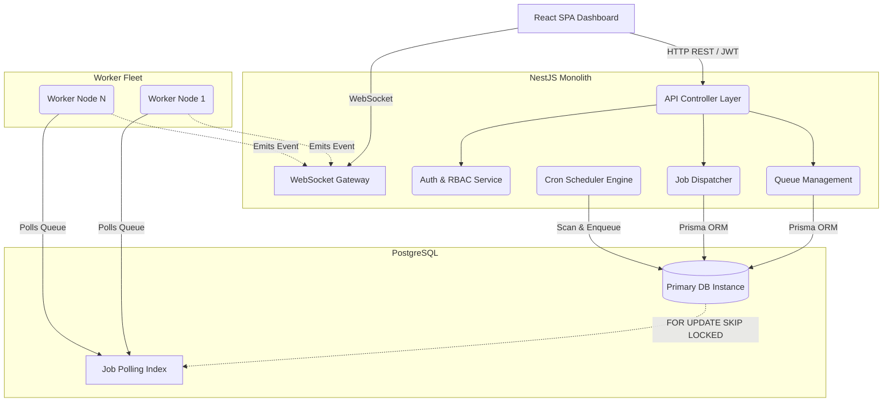
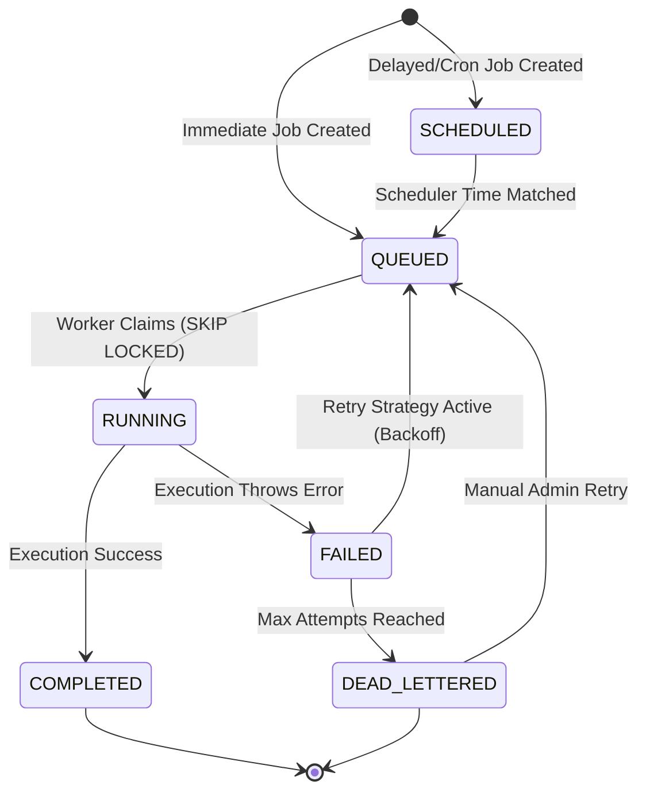

# Architecture Document: Distributed Job Scheduler

## 1. High-Level System Architecture

The system is designed as a modular, monolithic repository utilizing NestJS for the backend, React for the control plane, and PostgreSQL as the unified datastore and locking engine. The architecture ensures high throughput, strict referential integrity, and horizontal scalability of worker nodes.

## 2. Job Lifecycle State Machine

To guarantee exactly-once claiming and safe retry semantics, jobs transition through a strict state machine validated at the database level.

## 3. Core Component Breakdown

### API Server (Controllers)
Exposes the RESTful endpoints. It is protected globally by `@nestjs/throttler` (Rate Limiting) and uses Passport-JWT alongside a custom `RolesGuard` for Role-Based Access Control (RBAC). It ensures that HTTP traffic is physically separated from worker execution loops to prevent event-loop blocking.

### Worker Engine (`WorkerService`)
The beating heart of the scheduler. It runs an asynchronous `setInterval` loop that executes raw SQL:
`SELECT id FROM "Job" WHERE status = 'QUEUED' AND run_at <= NOW() ORDER BY priority DESC LIMIT $1 FOR UPDATE SKIP LOCKED`
This query safely claims jobs without deadlocking concurrent workers. The worker updates the `JobExecution` table with start times, executes the payload (which must be designed idempotently), and records the final result (success/fail) to the `JobLog` table.

### Scheduler Engine (`SchedulerService`)
Handles recurring Cron jobs and delayed jobs. It utilizes `cron-parser` to continuously evaluate the `ScheduledJob` table, dynamically injecting new job records into the main `Job` table when the cron interval triggers.

### WebSocket Gateway (`EventsGateway`)
Forwards real-time execution events (e.g., job completions, job failures, worker heartbeats) back to the React Dashboard. This allows the UI to stay perfectly synchronized with the database state without expensive HTTP polling.

## 4. Scaling Characteristics
While the current MVP operates on a single PostgreSQL instance (which can easily handle thousands of jobs per second with the optimized `@@index([queue_id, status, run_at, priority])`), the architecture is entirely stateless at the application layer. You can instantly spin up 100 `WorkerService` instances across a Kubernetes cluster, and they will safely share the queue load due to the atomic `SKIP LOCKED` database design.
