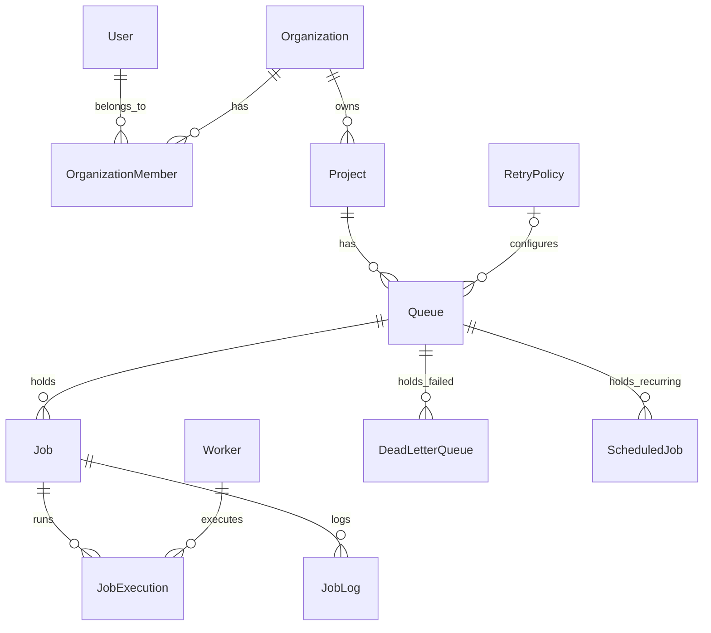

# Database Design

## Entity-Relationship Schema
The relational schema is highly normalized and designed for high throughput, utilizing PostgreSQL as the underlying engine. The database models the following core entities: `Users`, `Organizations`, `Projects`, `Queues`, `Jobs`, `JobExecutions`, `RetryPolicies`, `Workers`, `JobLogs`, `ScheduledJobs`, and `DeadLetterQueues`.



## Schema Explanations & Considerations

### Primary Keys & Foreign Keys
- **Primary Keys**: Every table utilizes a `UUID` as its primary key. UUIDs are generated at the application layer or database layer using `uuid_generate_v4()`. UUIDs are preferred over auto-incrementing integers to prevent ID-guessing (enumeration attacks), ease data migration, and allow disconnected clients to generate IDs before insertion.
- **Foreign Keys**: Explicit foreign keys enforce referential integrity across the hierarchy (e.g., `Job.queue_id` references `Queue.id`). 

### Cascading Behavior
- **ON DELETE CASCADE**: Hard links in the hierarchy utilize cascading deletes. For example, deleting a `Project` will automatically delete all associated `Queues`, which cascades down to `Jobs`, `JobExecutions`, and `JobLogs`. This prevents orphaned records and maintains strict database hygiene without requiring multi-step application-level deletion logic.

### Normalization
The database is strictly normalized (3NF) to reduce data anomalies and keep high-throughput tables lean:
- **Separation of Execution State**: The `Job` table only stores the *current* state and payload of a job. The history of attempts is normalized into the `JobExecution` table. This keeps the `Job` row size extremely small, which is critical because it is the most heavily polled and updated table in the system.
- **Separation of Logs**: Detailed textual logs are split into the `JobLog` table. Storing heavy text strings directly on the `Job` or `JobExecution` tables would cause PostgreSQL page bloat, significantly slowing down the worker polling queries.

### 5. Worker & WorkerHeartbeat
**Purpose**: Registers active worker nodes and tracks their continuous health and load capacity.

- **`Worker`**: Contains the `status` (`ACTIVE`, `STOPPED`) and a rapidly updated `last_heartbeat_at` field. Updating this field in-place provides extremely fast crash-detection for the cluster manager.
- **`WorkerHeartbeat`**: An append-only historical log satisfying strict auditing and analytics requirements. It records the worker's `current_load` (active jobs being processed) and `cpu_percent` at a given `reported_at` timestamp.

*Note: The hybrid approach (in-place `last_heartbeat_at` on Worker + append-only `WorkerHeartbeat` records) ensures we meet auditing requirements while avoiding slow analytical queries on the hot path.* 

### Indexes & Performance Considerations
Efficient indexing is the most critical component of a polling-based job scheduler. 
- **The Polling Query Index**: The worker continuously executes: 
  ```sql
  SELECT id FROM "Job" WHERE status = 'QUEUED' AND run_at <= NOW() ORDER BY priority DESC
  ```
  To make this `O(log N)` instead of a full table scan, a composite index is applied to the `Job` table:
  `@@index([queue_id, status, run_at, priority])`
  This exact covering index allows the PostgreSQL query planner to immediately identify candidate jobs without scanning non-relevant or locked rows.
- **Foreign Key Indexes**: All foreign keys (e.g., `queue_id` on `Job`, `job_id` on `JobExecution`) are indexed to ensure that cascading deletes and `JOIN` operations (like fetching a job with its executions) are nearly instantaneous.
- **SKIP LOCKED**: Performance is further guaranteed by utilizing PostgreSQL's `FOR UPDATE SKIP LOCKED`. When multiple concurrent workers hit the `Job` table index, they automatically bypass rows currently locked by other transactions, completely eliminating row-level lock contention and deadlocks.
