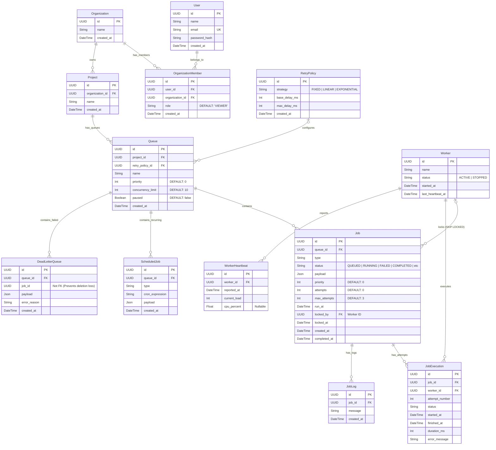

# Entity-Relationship (ER) Diagram

This document contains the strict Entity-Relationship model mapping precisely to the PostgreSQL database generated by Prisma.

## Schema Highlights
1. **UUID Primary Keys**: All entities use UUIDs `v4` to prevent ID guessing and simplify disconnected client insertion.
2. **Cascading Deletes**: Relationships like `Project -> Queue -> Job -> JobExecution` utilize strict `ON DELETE CASCADE` referential integrity. Deleting a Project instantly purges all related queues and jobs without orphan rows.
3. **Idempotent DLQ**: Notice that `job_id` inside the `DeadLetterQueue` is *not* a foreign key. This allows the system to completely purge rows from the main `Job` table to save space, without accidentally cascading the deletion to the DLQ, thus preserving the failure history indefinitely.
4. **Decoupled Execution Logs**: Keeping `JobExecution` and `JobLog` separate from `Job` ensures the `Job` row remains extremely small (byte size), dramatically accelerating the continuous index scans performed by the Worker fleet.
